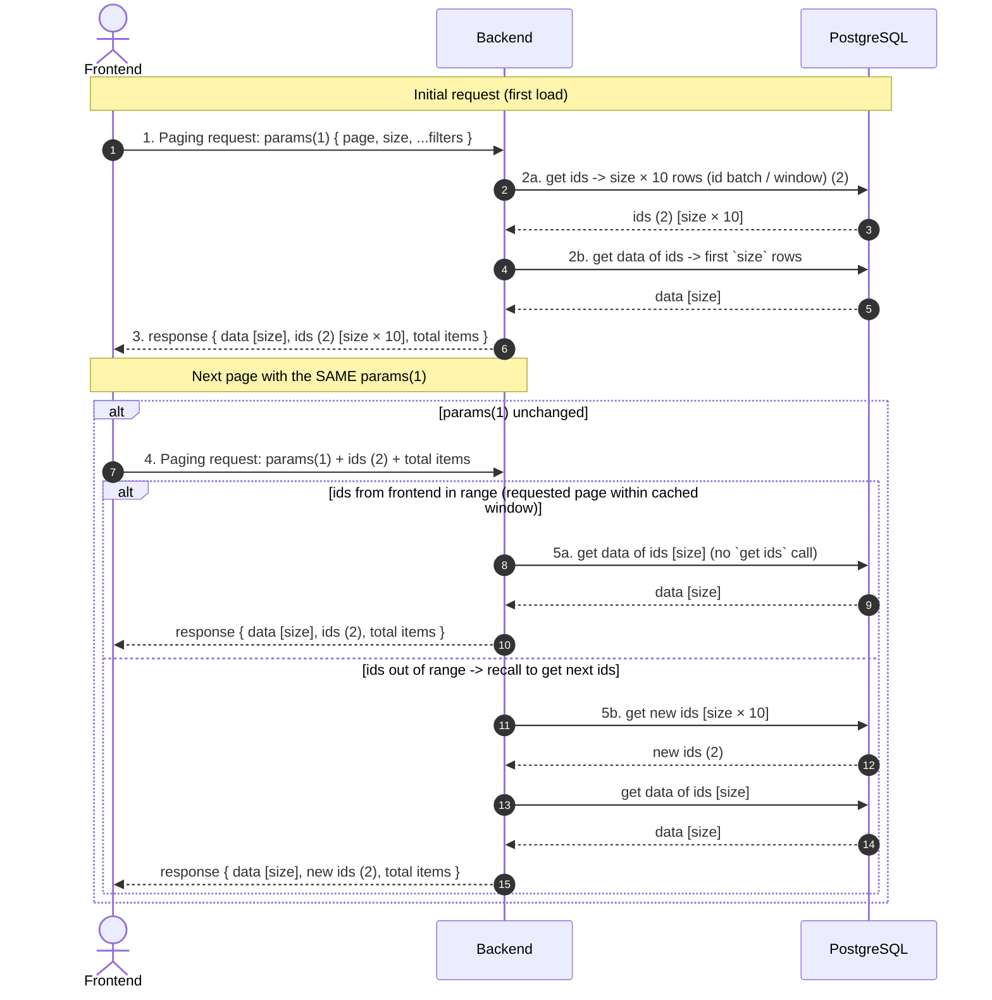

# Paging Process — Sequence Diagram

## Flow Summary

1. **Frontend → Backend**: sends paging params `(1)` — `page`, `size`, plus any filters.
2. **Backend processing**:
   - `get ids` returns a batch of `size × 10` IDs (the reusable paging window) `(2)`.
   - `get data of ids` returns data for only `size` IDs (the current page).
3. **Backend → Frontend**: returns the page `data`, the full `ids (2)` batch, and `total items`.
4. **Same params** → Frontend sends back `params (1)` together with the cached `ids (2)` and `total items`.
5. **Backend decides**:
   - If the requested IDs are **in range** of the cached window → fetch `get data of ids (size)` straight away, skipping a redundant ID query.
   - If the IDs are **out of range** → re-fetch the next ID batch (`recall get ids`) before loading the page data.
